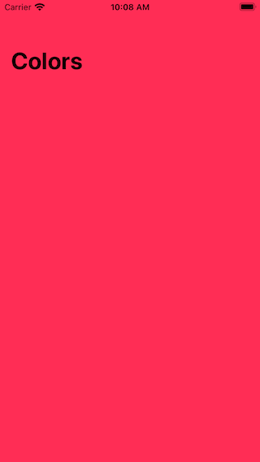

# Random Colors (UIKit)

## Description

From a list of colors tap on any of them to see the color in full screen.

## Tags

Through these tags you can navigate through each section developed on the app.

### uinavigationcontroller-app-navigation-setup

| Screenshot 01 |
| ------------- |
|  |